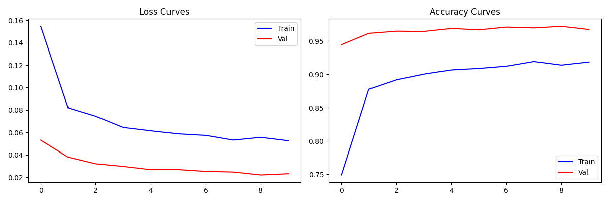
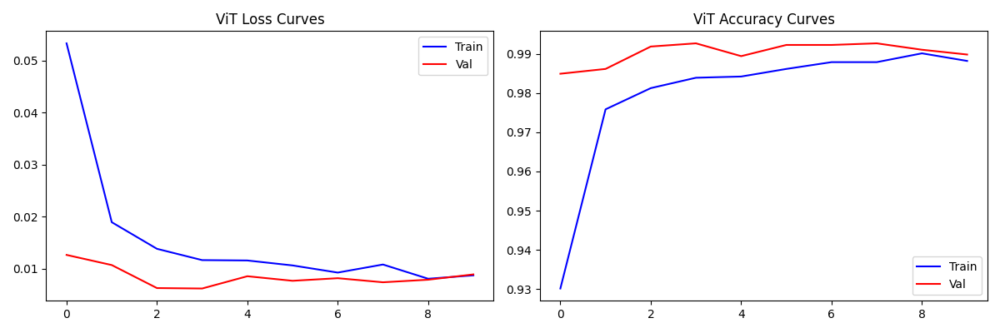

# CNN Multi-Label Classification

## Project Overview

This project implements a multi-label image classification system to identify cats, dogs, and specific named pets (Moris, Motya, Biatrix) in images. The solution employs deep learning techniques using ResNet50 and Vision Transformer (ViT) architectures, with ensemble methods for improved performance.

### Competition Format
- **Task**: Multi-label binary classification for 5 classes (Cat, Dog, Moris, Motya, Biatrix)
- **Evaluation Metric**: **Macro F1-score** - equally weights F1 of each class regardless of frequency
- **Submission Format**: Binary probabilities for each class per test image
- **Challenge**: Balanced performance across all classes, especially rare ones (Moris, Motya, Biatrix)

## Dataset Analysis

### Data Distribution
- **Total Training Samples**: 12,260 images
- **Total Test Samples**: 18,390 images
- **Classes**: Cat, Dog, Moris, Motya, Biatrix (multi-label classification)

### Label Distribution Analysis
```
Category Distribution:
Cat     : 5,077 (41.4%)
Dog     : 5,025 (41.0%)  
Other   : 2,162 (17.6%)
Moris   : 56 (0.5%)
Motya   : 42 (0.3%)
Biatrix : 41 (0.3%)
```

### Label Combination Patterns
```
Single Labels:
Cat                        4,989 (40.69%)
Dog                        4,984 (40.65%)
None (Other)               2,162 (17.63%)

Multi-Label Combinations:
Cat + Moris                   42 (0.34%)
Biatrix + Dog                 37 (0.30%)
Cat + Motya                   32 (0.26%)
Cat + Moris + Motya           10 (0.08%)
Biatrix + Cat + Dog + Moris    4 (0.03%)
```

**Key Insights:**
- Highly imbalanced dataset with rare classes (Moris, Motya, Biatrix)
- Hierarchical relationships: Moris/Motya are specific cats, Biatrix is a specific dog
- Most images contain single labels, with few multi-label cases

## Feature Engineering

### Data Preprocessing
- **Image Normalization**: ImageNet standard normalization (mean=[0.485, 0.456, 0.406], std=[0.229, 0.224, 0.225])
- **Data Augmentation**: 
  - RandomResizedCrop(224)
  - RandomHorizontalFlip
  - Resize(256) + CenterCrop(224) for validation
- **Stratified Splitting**: 80/20 train-validation split based on label combinations

### Hierarchical Rules Implementation
Applied domain knowledge through post-processing rules:
- If Moris or Motya is predicted → Cat must also be predicted
- If Biatrix is predicted → Dog must also be predicted

## Model Architectures

| Component | ResNet50 + Custom Block | Vision Transformer (ViT-Base) | Ensemble Methods |
|-----------|-------------------------|-------------------------------|------------------|
| **Base Architecture** | Pre-trained ResNet50 | Pre-trained ViT-Base-Patch16-224 | Multiple model combination |
| **Backbone Status** | Frozen | Fully trainable | N/A |
| **Custom Additions** | Additional residual block (2048 channels) | None | Soft voting mechanism |
| **Classifier** | Linear layer (2048 → 5 classes) | Built-in head (768 → 5 classes) | Probability averaging |
| **Total Parameters** | 99,019,845 | 85,802,501 | 2x base models |
| **Trainable Parameters** | 75,511,813 (76.3%) | 85,802,501 (100%) | All ensemble models |
| **Input Size** | 224×224 | 224×224 | 224×224 |
| **Patch Size** | N/A | 16×16 | N/A |
| **Loss Function** | BCEWithLogitsLoss | BCEWithLogitsLoss | BCEWithLogitsLoss |
| **Optimizer** | Adam | Adam | Adam |
| **Learning Rate** | 1e-5 | 1e-5 | 1e-5 |
| **Batch Size** | 32 | 32 | 32 |
| **Epochs** | 10 | 10 | 10 |
| **Key Features** | Custom residual connections | Self-attention mechanism | Model diversity |
| **Training Strategy** | Transfer learning + fine-tuning | Full fine-tuning | Ensemble averaging |

## Training Results

### ResNet50 Training Progression
```
Training samples: 9,808 | Validation samples: 2,452
Trainable Parameters: 75,511,813 / Total: 99,019,845 (76.3%)

Epoch 1/10: Train 0.1609/0.7330, Val 0.0385/0.9604
Epoch 2/10: Train 0.0800/0.8787, Val 0.0529/0.9466
Epoch 3/10: Train 0.0720/0.8937, Val 0.0348/0.9629
Epoch 4/10: Train 0.0661/0.8993, Val 0.0302/0.9666 ← Best
...
```



### Vision Transformer Training Progression
```
Training samples: 9,808 | Validation samples: 2,452
Trainable Parameters: 85,802,501 / Total: 85,802,501 (100.0%)

Epoch 1/10: Train 0.0534/0.9302, Val 0.0127/0.9849
Epoch 2/10: Train 0.0190/0.9758, Val 0.0107/0.9861
Epoch 3/10: Train 0.0139/0.9812, Val 0.0063/0.9918
Epoch 4/10: Train 0.0117/0.9839, Val 0.0062/0.9927 ← Best
Epoch 5/10: Train 0.0116/0.9842, Val 0.0086/0.9894
...
Final: Best validation accuracy: 0.9927 (99.27%)
```



### ResNet Ensemble Evaluation Results
```
Overall Metrics:
   Exact Match Accuracy: 0.9723 (97.23%)
   Subset Accuracy:      0.9723

Averages:
   Micro/Macro F1:        0.9758/0.7638
   Micro/Macro Precision: 0.9789/0.8303
   Micro/Macro Recall:    0.9727/0.7241

Per-Class Performance:
   Biatrix : F1=0.8750, P=0.8750, R=0.8750
   Cat     : F1=0.9823, P=0.9832, R=0.9813
   Dog     : F1=0.9776, P=0.9790, R=0.9761
   Moris   : F1=0.5556, P=0.7143, R=0.4545
   Motya   : F1=0.4286, P=0.6000, R=0.3333
```

## Competition Results

### Public Leaderboard Scores (Macro F1-Score)
| Model | Score | Rank Performance |
|-------|-------|------------------|
| **ViT Submission** | **0.95176** | 🥇 **Best** |
| ResNet2 Submission | 0.73661 | 2nd |
| Ensemble Submission | 0.21826 | 3rd |
| Previous Ensemble | 0.03223 | 4th (Worst) |

**Key Findings:**
- **ViT model achieved the best Macro F1-score (0.95176)** - significantly outperforming other approaches
- ViT performed exceptionally well on this multi-label classification task
- The Macro F1 metric rewards balanced performance across all classes, including rare ones (Moris, Motya, Biatrix)

## Model Insights and Analysis

### Strengths
1. **ViT Excellence**: Vision Transformer achieved outstanding Macro F1-score (0.95176), demonstrating superior balanced performance across all classes
2. **Hierarchical Rules**: Domain knowledge integration improved logical consistency
3. **Transfer Learning**: Pre-trained models provided excellent feature extraction
4. **Class Balance Handling**: Stratified splitting maintained label distribution

### Challenges
1. **Rare Class Performance**: Moris (F1=0.5556) and Motya (F1=0.4286) showed lower performance due to limited training samples
2. **Macro F1 Sensitivity**: The evaluation metric heavily penalizes poor performance on rare classes, making balanced performance crucial
3. **Multi-label Complexity**: Few multi-label examples made learning these patterns difficult
4. **Data Imbalance**: 17.6% "Other" category created classification challenges

### Optimization Insights
1. **Learning Curves**: Both models showed good convergence without overfitting
2. **ViT Superior Performance**: ViT achieved both higher validation accuracy (99.27%) and best competition performance (0.95176 Macro F1)
3. **Feature Learning**: Custom residual block in ResNet helped capture domain-specific patterns

## Technical Implementation

### Key Features
- **Multi-label Classification**: BCEWithLogitsLoss for independent class predictions
- **Soft Voting Ensemble**: Probability averaging for robust predictions
- **Hierarchical Post-processing**: Rule-based corrections for logical consistency
- **Stratified Validation**: Maintained label distribution across splits
- **Memory Efficient**: Frozen backbones with trainable heads

## Future Improvements

1. **Data Augmentation**: Advanced techniques for rare classes
3. **Architecture Diversity**: Include different model families in ensemble
5. **Multi-scale Training**: Different input resolutions for robust feature learning